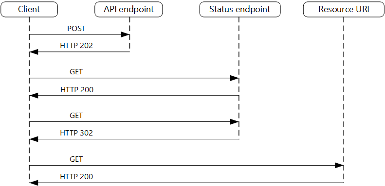

# User Story 2 - A `User` can create a `Board` with a `Name`

## Preconditions

- `User` must be authenticated

## Endpoint

Verb: `POST`
Url: `/board`

### Parameters

#### Name

Type: `string`
Maximum length: 128
Minimum length: 1

### Response

### Example

Request:

```json
{
    "name": "Smaragd OKR Board"
}
```

Response:

`Accepted 202`

```json
{
    "boardId": "b19354aa-b908-452f-a4ad-dfdff9285c7a",
    "status": "creating"
}
```

## Status-Endpoint

Verb: `GET`
Url: `/board/{BoardId}/status`

### Status Example

Request: `/board/b19354aa-b908-452f-a4ad-dfdff9285c7a/status`

Responses:

```json
{
    "boardId": "b19354aa-b908-452f-a4ad-dfdff9285c7a",
    "status": "creating"
}
```

```json
{
    "boardId": "b19354aa-b908-452f-a4ad-dfdff9285c7a",
    "status": "created"
}
```

## Process



1. Client calls API
2. Enqueue message in API Endpoint
3. Reply with status endpoint
4. Receive message
5. Process message, write result to blob
6. API calls status endpoint
7. Check for blob

## Affected Services

- Azure CosmosDb
- Azure Functions
- Azure Service Bus
- Azure Redis Cache
- Azure API Management
